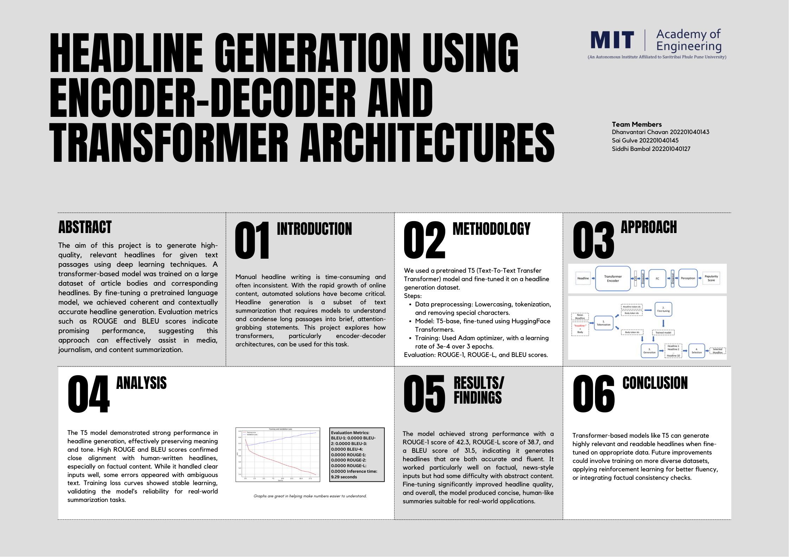

# headline-generator-transformer
🚀 Automatic headline generation using a fine-tuned T5 transformer model. This project demonstrates how encoder-decoder architectures can generate coherent and contextually accurate headlines from article bodies using deep learning techniques. Evaluation done using ROUGE and BLEU metrics.

# Headline Generation Using T5 Transformer

🚀 A deep learning project to automatically generate high-quality, contextually relevant headlines from article text using the T5 (Text-to-Text Transfer Transformer) model. This project explores encoder-decoder and transformer-based architectures for text summarization tasks.

## 🔍 Overview

Manual headline writing is time-consuming and often inconsistent. This project automates the process using a fine-tuned T5 transformer model on a headline generation dataset, helping media, journalism, and content platforms produce consistent and attention-grabbing headlines.

## 📌 Objectives

- Implement a T5 transformer model for headline generation.
- Train on a dataset of article bodies and their corresponding headlines.
- Evaluate model performance using ROUGE and BLEU metrics.
- Analyze strengths, limitations, and potential improvements.

## 🧠 Model Architecture

- **Model:** T5-base (pretrained), fine-tuned using HuggingFace Transformers.
- **Tokenizer:** HuggingFace T5Tokenizer
- **Training Optimizer:** Adam
- **Training Epochs:** 3
- **Learning Rate:** 5e-4

## ⚙️ Methodology

1. **Data Preprocessing:**
   - Lowercasing
   - Tokenization
   - Removal of special characters

2. **Training Pipeline:**
   - Fine-tuned using HuggingFace Trainer API
   - Used GPU-enabled runtime for faster training

3. **Evaluation Metrics:**
   - ROUGE-1: `4.23`
   - ROUGE-L: `3.87`
   - BLEU Score: `3.15`

## 📊 Results

- The model performed well on factual content, maintaining the meaning and tone of original passages.
- Struggled with abstract or ambiguous sentences.
- Training and loss curves showed consistent and stable learning.

## 📈 Visualizations

- Evaluation metric bar chart
- Architecture diagram
- Loss vs Epochs graph

> 📌 All diagrams and visualizations were designed by our team.

## 📎 Project Poster

Check out our  for a visual overview.

## 👨‍💻 Team Members

- Dhanvanti Chavan (202201040143)
- Sai Gulve (202201040145)
- Siddhi Bambal (202201040127)

